# RenCar

RenCar, Kotlin ve Jetpack Compose ile geliştirilmiş native bir Android araç
kiralama uygulamasıdır. Kullanıcılar uygulama üzerinden kimlik/ehliyet
doğrulaması yapabilir, haritada araç keşfedebilir, dakikalık/saatlik/günlük
plana göre rezervasyon oluşturabilir, aktif yolculuğunu canlı konumla takip
edebilir ve ödemesini cüzdan, kayıtlı kart veya gerçek İyzico entegrasyonu
üzerinden gerçekleştirebilir.

## Özellikler

- **Kimlik Doğrulama:** Telefon numarası ile kayıt, OTP doğrulama, oturum
  yönetimi.
- **Ehliyet Doğrulaması:** Ehliyet fotoğrafı + selfie yükleme, admin onay
  süreci ve uygulama içi anlık durum kontrolü (`UNDER_REVIEW` /
  `APPROVED` / `REJECTED`).
- **Harita / Araç Keşfi:** MapLibre tabanlı harita üzerinde yakındaki
  araçların keşfi.
- **Rezervasyon ve Kiralama:** Dakikalık, saatlik veya günlük kiralama
  planlarıyla rezervasyon oluşturma; teslim öncesi araç durumu kontrolü.
- **Aktif Yolculuk:** WebSocket (Socket.IO) üzerinden canlı konum takibi ile
  devam eden yolculuğun anlık izlenmesi.
- **Ödeme:** Cüzdan bakiyesi, kayıtlı kart (simüle) ve gerçek İyzico sandbox
  entegrasyonu ile ödeme; ortak "Ödeme Başarılı" onay ekranı.
- **Cüzdan / Kart Yönetimi:** Bakiye yükleme, kart ekleme ve kayıtlı kart
  listesi.
- **Kiralama Geçmişi:** Tamamlanan yolculukların ve ödemelerin geçmişi.
- **Profil:** Kullanıcı bilgileri, rol/ehliyet durumu rozeti, referans kodu
  paylaşımı, ayarlar (koyu mod dahil).

## Ekran Görüntüleri

| | | |
|---|---|---|
| 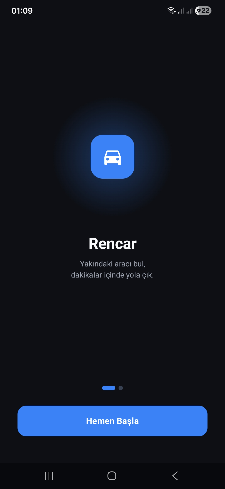<br>Onboarding | 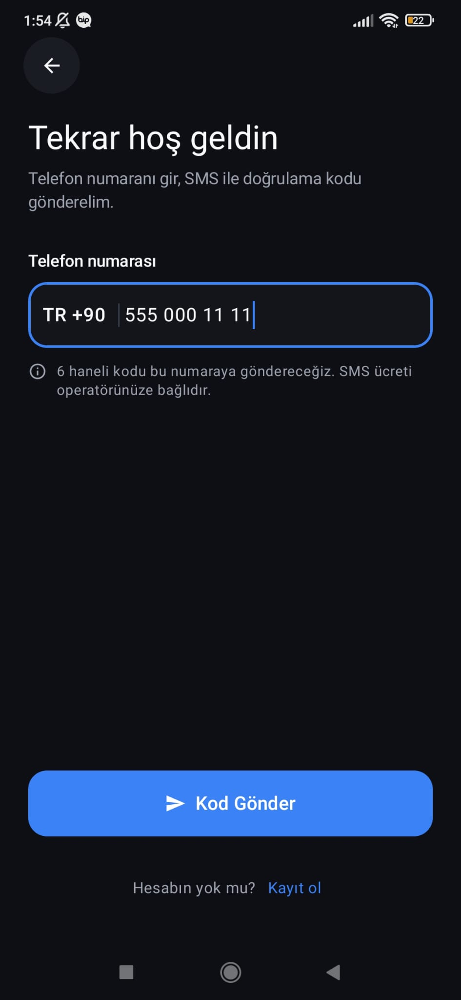<br>Giriş | 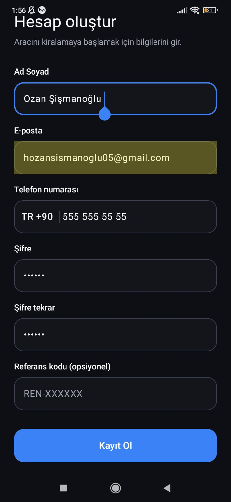<br>Kayıt Ol |
| 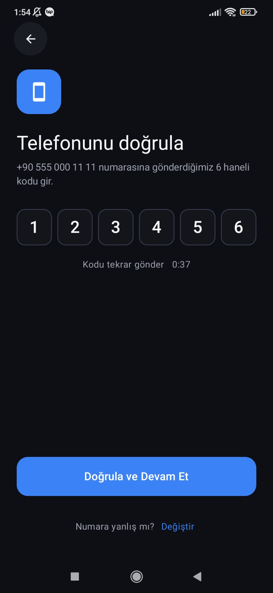<br>OTP Doğrulama | 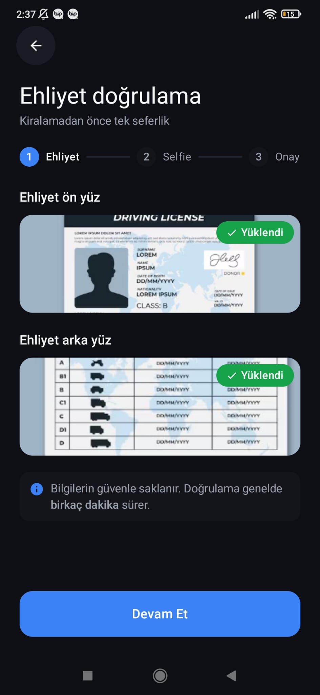<br>Ehliyet Doğrulama | 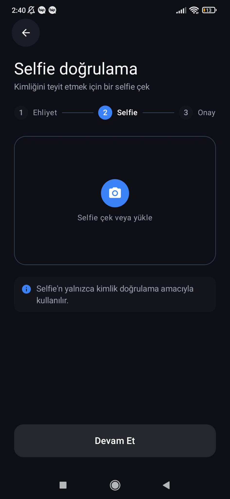<br>Ehliyet Selfie Doğrulama |
| 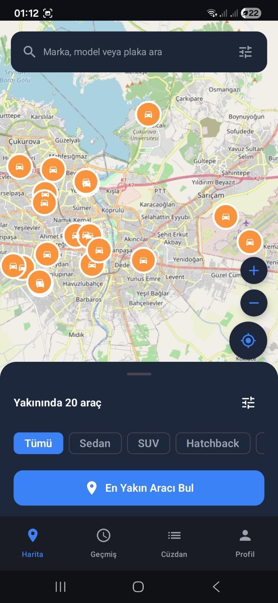<br>Harita / Araç Keşfi | 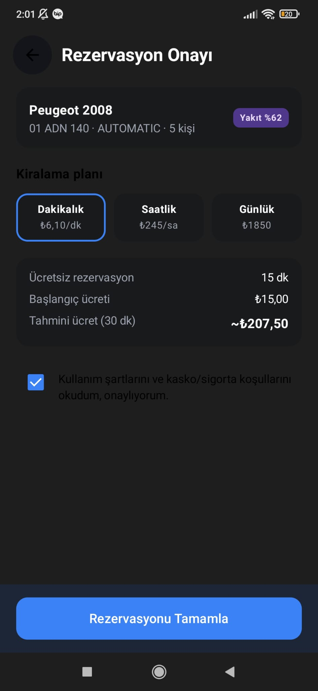<br>Rezervasyon Onayı | 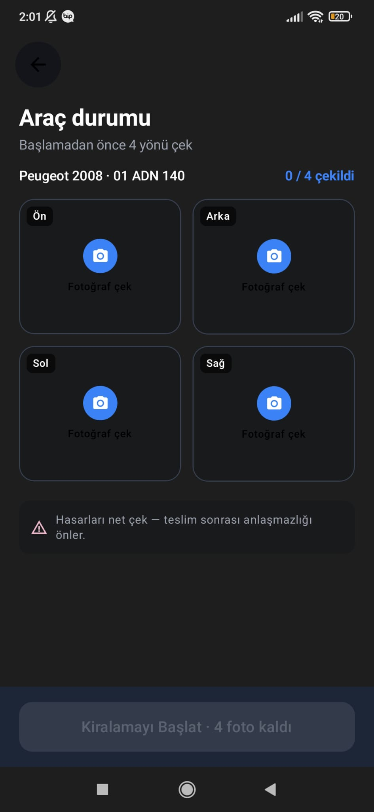<br>Araç Durumu (Teslim Öncesi Kontrol) |
| 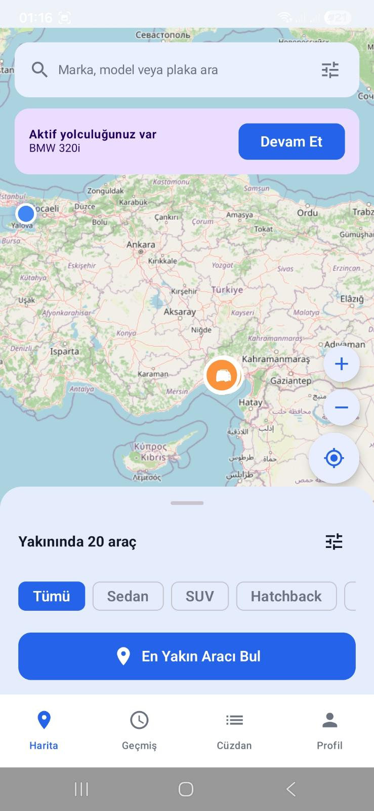<br>Aktif Yolculuk Bildirimi | 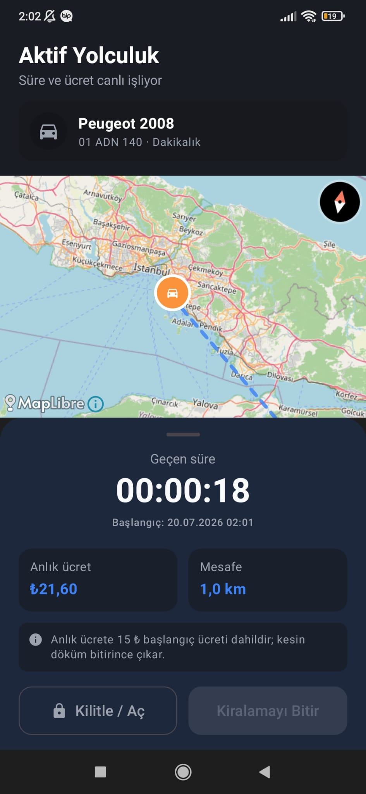<br>Aktif Yolculuk | 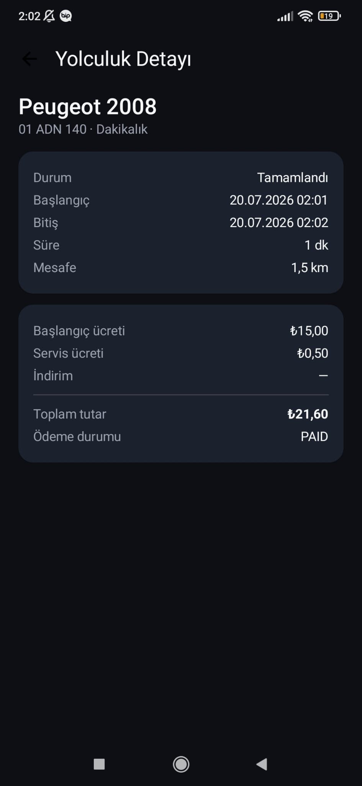<br>Yolculuk Detayı |
| 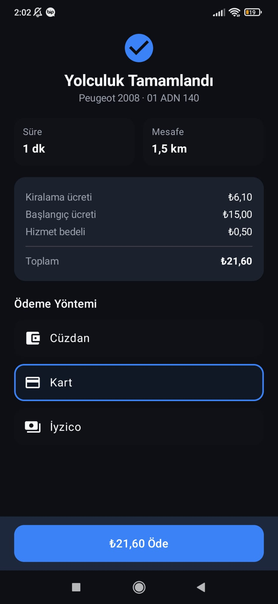<br>Yolculuk Tamamlandı | 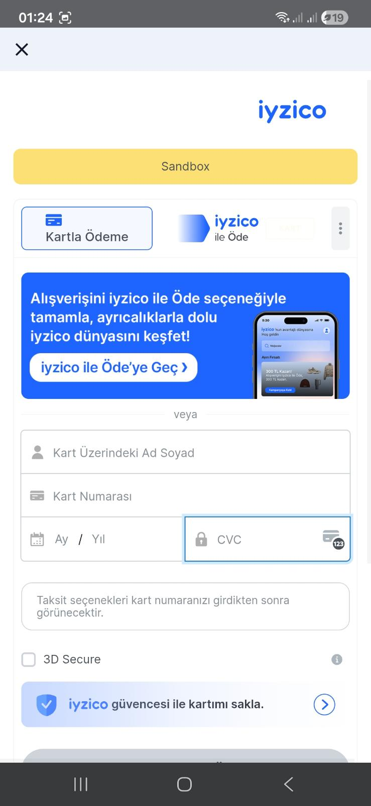<br>İyzico Ödeme (Sandbox) | 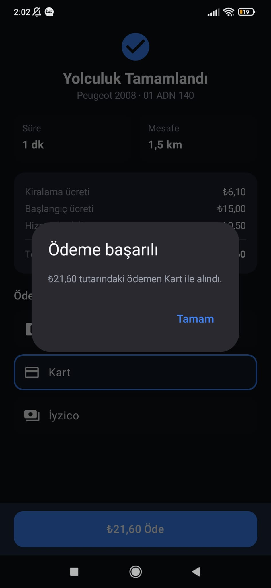<br>Ödeme Başarılı |
| 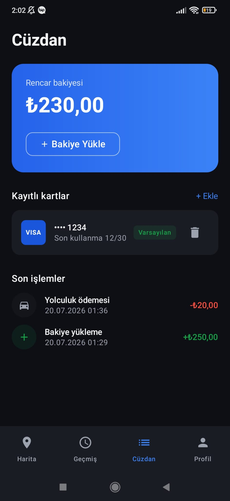<br>Cüzdan | 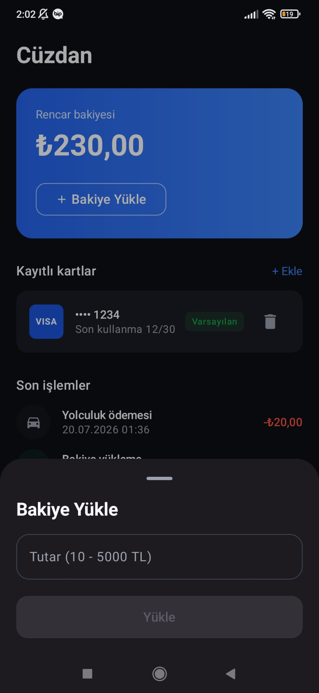<br>Bakiye Yükle | 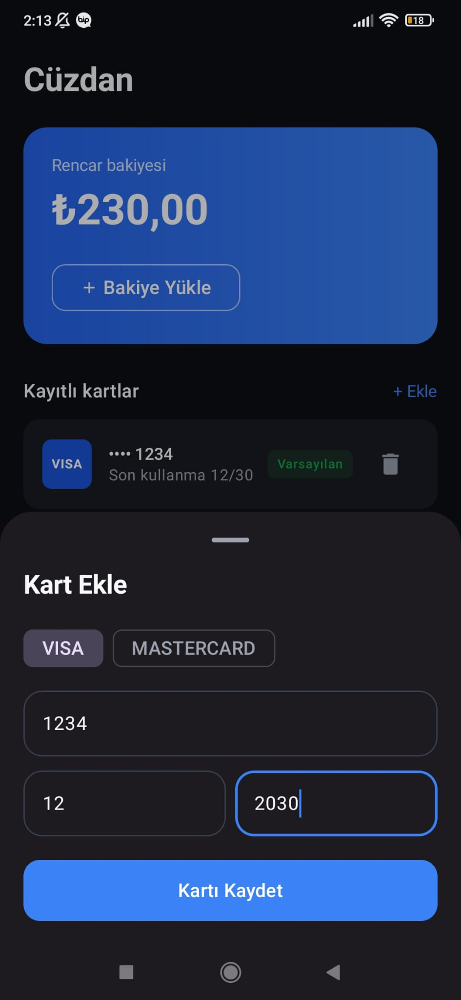<br>Kart Ekle |
| 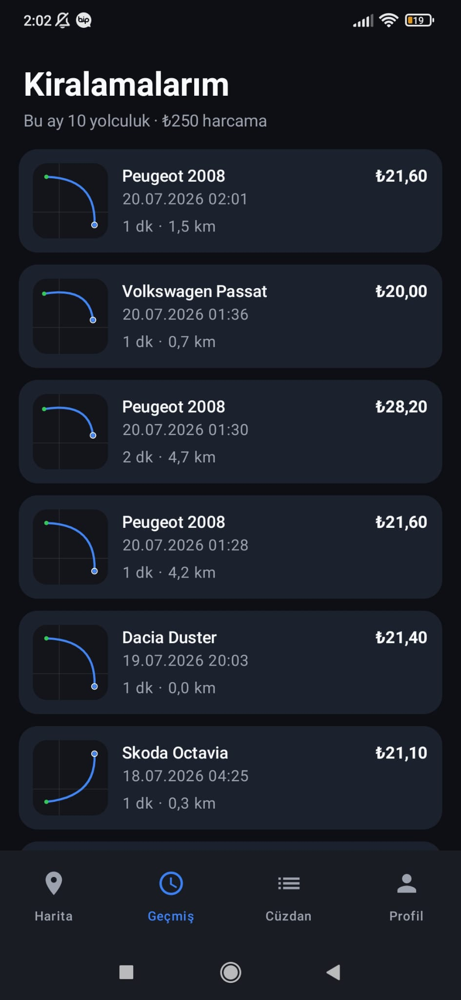<br>Kiralama Geçmişi | 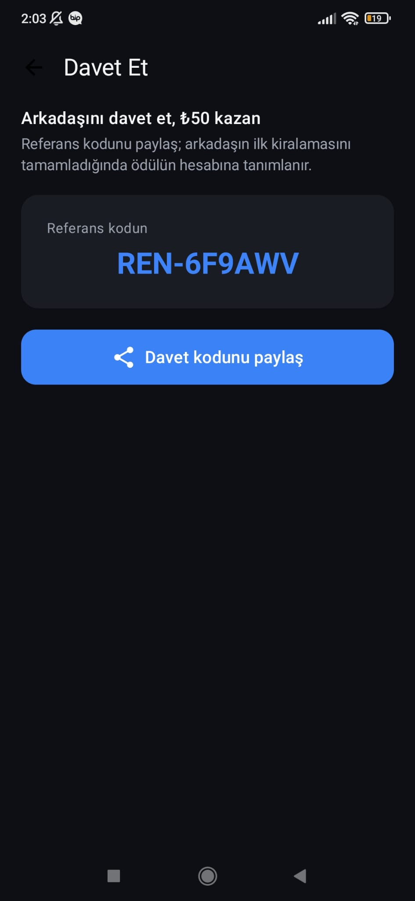<br>Davet Et / Referans | 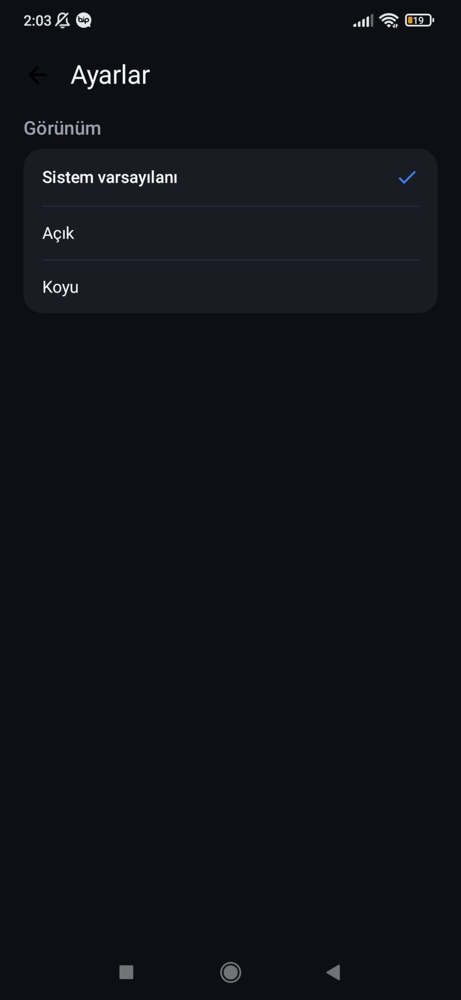<br>Koyu Mod (Ayarlar) |
| 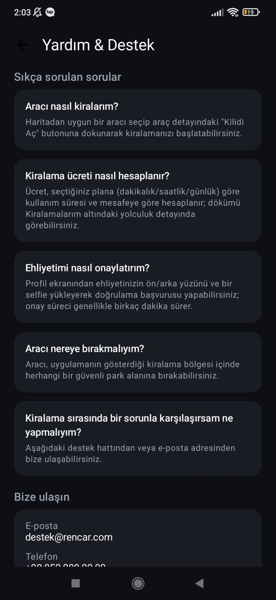<br>Yardım & Destek | | |

### Canlı Konum Takibi


## Teknoloji Yığını

Sürüm numaraları `gradle/libs.versions.toml` dosyasından alınmıştır.

| Katman | Teknoloji | Sürüm |
|---|---|---|
| Dil | Kotlin | 2.2.10 |
| Build | Android Gradle Plugin (AGP) | 9.2.1 |
| Annotation Processing | KSP (Kotlin Symbol Processing) | 2.3.9 |
| Dependency Injection | Hilt | 2.59.2 |
| UI | Jetpack Compose BOM | 2026.02.01 |
| Navigasyon | Compose Navigation | 2.9.8 |
| Ağ | Retrofit | 3.0.0 |
| Ağ | OkHttp | 4.12.0 |
| Gerçek Zamanlı | Socket.IO Client | 2.1.1 |
| Harita | MapLibre Android SDK | 11.8.0 |
| Görsel Yükleme | Coil | 3.3.0 |
| Yerel Depolama | DataStore Preferences | 1.2.1 |

## Mimari

Uygulama **MVI (Model-View-Intent)** deseniyle geliştirilmiştir. Her ekran
dört dosyadan oluşur; bağımlılık yönü tek yönlüdür:

```
<Feature>Contract.kt   — State / Intent / Effect tanımları
<Feature>ViewModel.kt  — İş mantığı, state yönetimi
<Feature>Route.kt      — ViewModel bağlantısı, Effect tüketimi, navigasyon
<Feature>Screen.kt     — Tamamen stateless Composable UI
```

Kaynak kod paket yapısı:

```
app/src/main/java/com/turkcell/rencar_pair/
  feature/      # Ekranlar (Contract/ViewModel/Route/Screen dörtlüsü)
  data/         # Repository, network (Retrofit/DTO), local (DataStore)
  domain/       # Ekranlara bağlı olmayan iş kuralları
  di/           # Hilt modülleri
  navigation/   # RenCarNavHost, MainScaffold, BottomNavItem
```

Öne çıkan mimari kararlar (bkz. [docs/decisions.md](docs/decisions.md)):

- **API enum alanları String olarak tutulur.** Backend'den gelen rol
  (`"PENDING"`, `"CUSTOMER"`) veya ehliyet durumu (`"UNDER_REVIEW"`,
  `"APPROVED"`, `"REJECTED"`) gibi alanlar Kotlin `enum class` yerine
  doğrudan `String` olarak modellenip karşılaştırılır.
- **Nav-graph-scoped paylaşılan ViewModel'ler MVI Contract kullanmaz.**
  Birden fazla ekran arasında ham state paylaşan ViewModel'ler (ör.
  `LicenseFlowViewModel`), tek bir Screen'e bağlı olmadıkları için
  Intent/Effect sözleşmesi yerine doğrudan fonksiyon çağrılarıyla kontrol
  edilir.
- **`PostAuthNavigationResolver`:** Giriş, OTP doğrulama ve kayıt akışlarının
  ortak kullandığı, `AuthRepository.getMe()` ve `LicenseRepository.getStatus()`
  sonuçlarına bakarak kullanıcıyı `Home`, `LicenseUpload` veya
  `LicensePending` hedeflerinden birine yönlendiren merkezi karar
  mekanizmasıdır.

Detaylı mimari kurallar için:

- [docs/architecture/mvi-overview.md](docs/architecture/mvi-overview.md) — Genel yapı, katman düzeni, Route/Screen ayrımı
- [docs/architecture/mvi-contracts.md](docs/architecture/mvi-contracts.md) — State / Intent / Effect kuralları
- [docs/architecture/mvi-viewmodel-rules.md](docs/architecture/mvi-viewmodel-rules.md) — ViewModel şablonu ve kuralları
- [docs/api/openapi.json](docs/api/openapi.json) — Backend API şeması

## Kurulum

1. Depoyu klonlayın:

   ```
   git clone <bu-repo-url>
   ```

2. Android Studio ile proje kök dizinini açın ve Gradle senkronizasyonunun
   tamamlanmasını bekleyin.

3. Uygulama, backend olarak `https://rencarv2.halitkalayci.com/` adresini
   kullanacak şekilde yapılandırılmıştır; ek bir ayar gerekmez.

4. Uygulamayı çalıştırın:

   ```
   ./gradlew :app:installDebug
   ```

   veya Android Studio üzerinden bir emülatör/cihaz seçip **Run** ile
   başlatın.

## İyzico Sandbox Test Verileri

Ödeme ekranında İyzico ile test ödemesi yapmak için aşağıdaki sandbox
verileri kullanılabilir (yalnızca test amaçlıdır, gerçek ödeme değildir):

| Alan | Değer |
|---|---|
| Kart Numarası | 5528790000000008 |
| Son Kullanma Tarihi | 12/2030 |
| CVC | 123 |
| SMS Doğrulama Kodu | 283126 |
